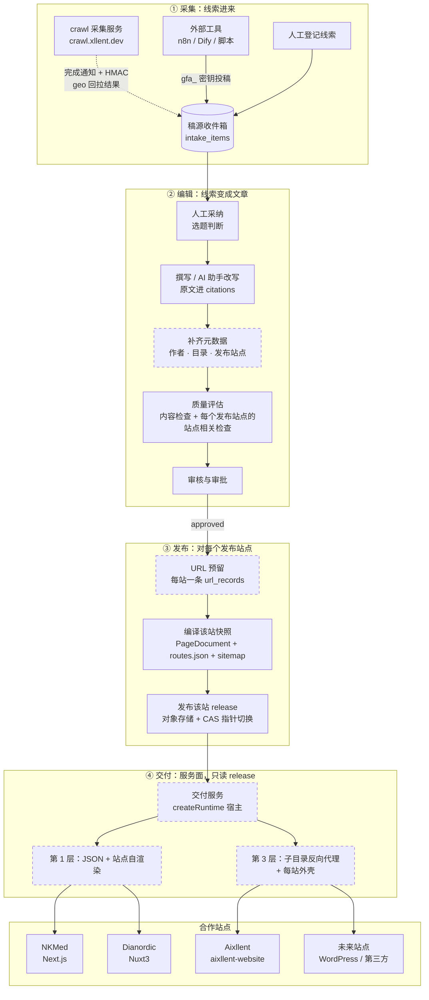
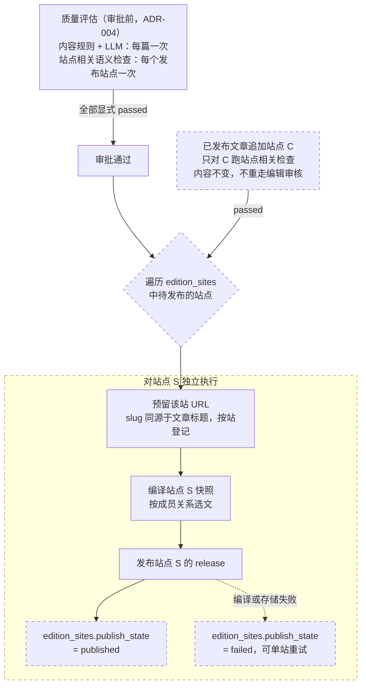
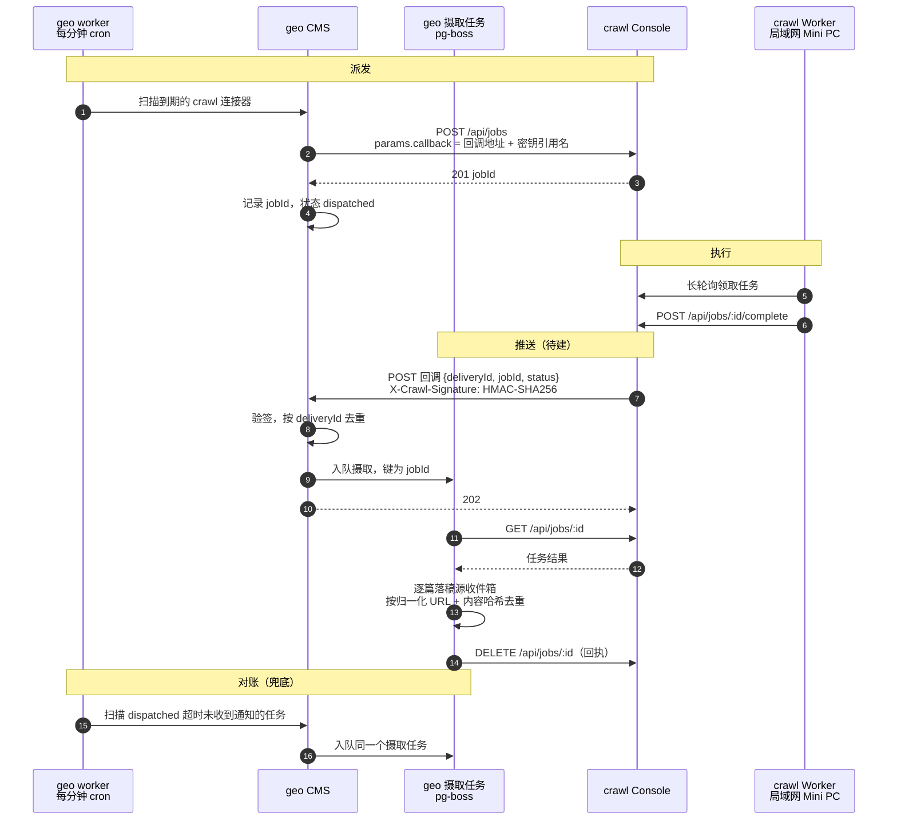
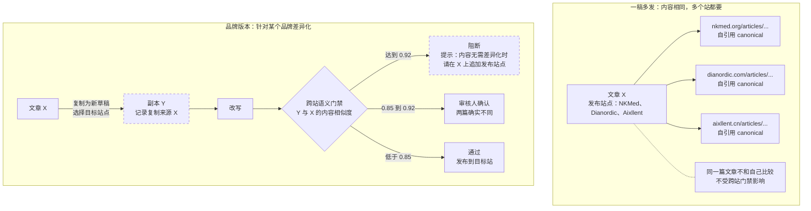
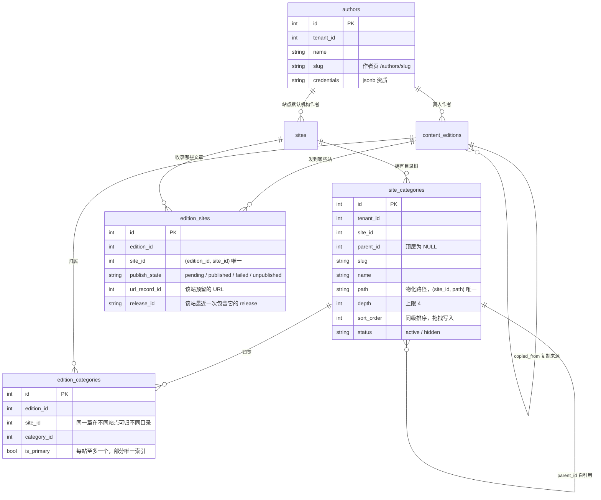
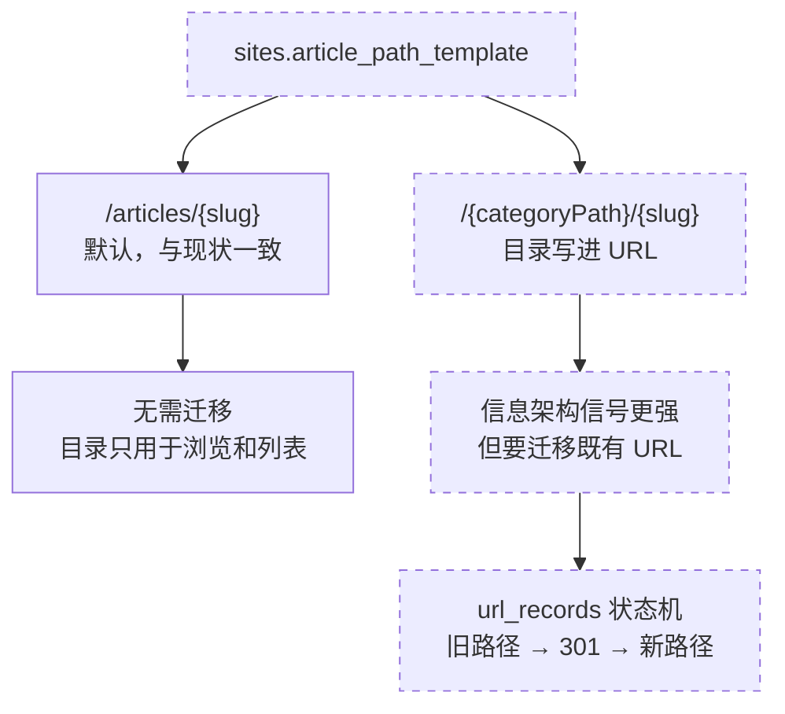
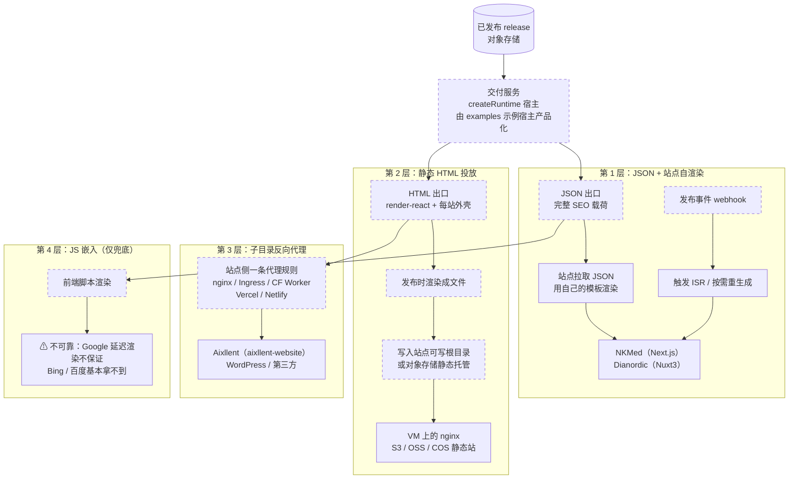
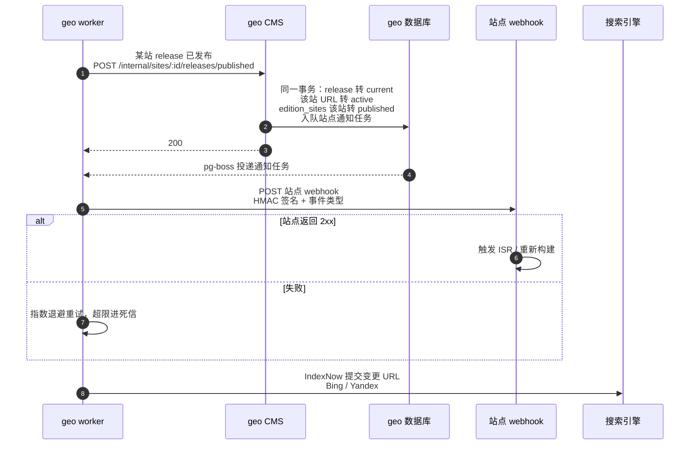

# 内容生产与多站交付架构

- **状态**：目标架构（部分已实现，部分待建设）
- **日期**：2026-09-23
- **范围**：从外部采集到文章在各合作站点可被搜索引擎收录的完整链路
- **约束来源**：[产品说明](product.md) 4.3、5.4（一稿多发与品牌版本）、[ADR 001 控制面与服务面分离](adr/001-control-plane-serving-plane.md)、[ADR 004 质量阈值 fail-closed](adr/004-quality-thresholds-fail-closed.md)、[ADR 007 内容运营领域模型](adr/007-content-operations-domain-model.md)

本文是全链路流程的权威图示。数据模型见[架构说明](architecture.md)，投稿接口契约见[集成投稿](intake-integration.md)。

图中标注：**实线框**＝已实现，**虚线框或虚线箭头**＝待建设。

---

## 1. 全景流程

一篇文章从线索到被收录，要穿过四个阶段：**采集 → 编辑 → 发布 → 交付**。前三个阶段在控制面，第四个阶段在服务面。

**两处断点**：

1. **发布链路只认单个站点**（第 2 节）。URL 预留、编译快照、发布操作、质量评估四处全部只取单数 `site_id`，一稿多发只存在于数据层和 Console。图中第 ③ 阶段"对每个发布站点"是待建设的形态。
2. **服务面没有生产宿主**。`createRuntime()` 只被单测和 `examples/` 下两个测试夹具调用（[架构说明](architecture.md)第 187 行明确它们"不是产品的一部分"），编译产物没有生产消费者。`workflowStatus=published` 的真实含义是"产物就绪"，不是"网上能访问"。

第 2 层（静态 HTML 投放）没有出现在全景里，因为当前三个站都不适用；它面向有可写站点根目录或对象存储静态托管的站点，见第 6 节。

---

## 2. 发布链路多站化

`content_editions.sites` 是数组，但发布链路从不读它：

| 环节 | 位置 | 当前行为 |
| --- | --- | --- |
| 新建文章 | `apps/cms/src/server/repositories/editions.ts:212` | `site_id = site ?? sites[0]` |
| URL 预留 | `apps/cms/src/server/repositories/edition-workflow.ts:396-401` | 只为 `site_id` 预留 |
| 编译快照 | `apps/cms/src/server/repositories/compile-snapshot.ts:86` | 按 `site_id` 选文章 |
| 发布操作 | `apps/cms/src/server/repositories/publish-operations.ts:52` | 只发 `site_id` |
| 质量锚点 | `apps/cms/src/services/embedding-store.ts:56,72` | 只按 `site_id` 做同站比较 |
| 改站点分配 | `apps/cms/src/server/routes/edition-ops.ts:45,197-199` | 只允许 draft 到 approved，已发布文章改站点报 `EDITION_ASSIGNMENT_SITE_LOCKED` |

结果是勾选多个站点、实际只发第一个，且不报错；而数据库直读的 `/api/delivery/*` 按 `sites` 数组列文章（`apps/cms/src/server/routes/delivery.ts:164`），其他站点能列出这篇文章但拿不到 URL。

目标形态：新增 `edition_sites` 记录每站的发布事实——发到哪些站、每站的 URL、release 与发布状态。按产品说明 5.4，**每个站点发布的都是文章本身的内容，不做站点变体**。发布状态按站拆开，落实 ADR-007 已决定的"编辑状态 / 发布状态 / 质量状态"三维拆分。

**部分失败是常态**：A 站成功、B 站失败时，文章的编辑状态不变，只有 B 站的发布状态记为失败并可单独重试。

**站点相关检查必须按站跑**：同站标题查重与跨站内容查重都以站点为锚点，现在只以主站点为锚点。另外相似度查询（`apps/cms/src/services/embedding-similarity.ts:53-67`）按 `embeddings.site_id` 过滤，而该列只记主站点，别的文章做同站查重时看不到"这篇也发在 B 站"——查询需改为按成员关系过滤。

**撤下站点**与追加对称：该站 URL 转 gone（410）→ 发布该站新 release → 发出 `unpublished` 事件（第 7 节），不影响其他站点。

---

## 3. 采集：crawl 主动推

crawl 现状是纯拉取（建任务后由消费方轮询）。目标是 **crawl 在任务完成时主动通知 geo**。通知只带任务 ID 与状态，结果由 geo 回拉：集成与内部接口的请求体上限都是 1 MiB，一次采集十篇中文长文就可能超过；瘦通知还让推送与对账共用一条摄取路径。

**设计要点**：

1. **两层幂等**。投递级用 `deliveryId` 挡同一次通知的重试；文章级用归一化 URL 与内容哈希挡跨任务的重复采集（复用现有 `normalized_url` / `content_hash` 索引）。只用投递 ID 挡不住第二天新任务带来的重复。
2. **摄取成功后回执删除 crawl 侧任务**，同时解决 crawl `jobs.json` 无限增长的问题。
3. **crawl 通道永不自动成稿**。`autoAdopt` 是 gfa_ 密钥的属性，crawl 走连接器通道天然不经过自动成稿分支；`shouldAutoAdopt` 对 crawl 通道显式返回 false，防止被转投 webhook 通道绕过。采集稿是他站原文，定位是选题线索与素材。
4. **出站凭据**：crawl 的 API 密钥与回调 HMAC 密钥放服务器凭据文件，连接器的 `secret_reference` 只存引用名（该列目前全仓零引用，需补读取逻辑）。
5. **crawl 侧待补**：图片 URL 绝对化、任务删除接口、robots.txt 遵守与按域名限速、毒任务重领上限、Worker 离线时的租约定时回收。

---

## 4. 编辑：一稿多发与品牌版本

按[产品说明](product.md) 5.4：**一篇文章可以选择多个发布站点，以相同内容发布到每个站点，不设主从，不做站点变体**；需要针对品牌差异化时，用文章详情里现成的「复制为新草稿」复制成独立文章，改写后发到目标站点。

两条路由现有的跨站语义门禁分流（阈值来自站点设置，`packages/quality-rules/src/semantic/decision.ts:126-165`）：

**门禁拦下轻改的副本是期望行为**：只改几个字的副本在搜索引擎眼里和原文是同一篇，发出去拿不到额外排名，这种情况应当走"追加站点"。阈值可以在站点设置里按站调整。图中虚线部分是待改进的复制流程：复制时直接选目标站点（现在副本原样带走原文的站点分配，`edition-ops.ts:102-103`）、记录复制来源、阻断提示改为中文并给出下一步（现在是英文技术语句，`decision.ts:135`）。

**自引用 canonical**（canonical 指向页面自己）是 Google 官方推荐的做法，而且不表达任何主从关系。编译器现在生成的就是这种（`packages/compiler/src/seo/urls.ts:25-34`）。内容相同时，搜索引擎对同一查询通常只展示其中一个站点的版本，这是一稿多发的已知代价。

**作者按站解析**：文章作者（`content_editions.author_id`，真人，可空）> 站点机构作者（`sites.default_author_id`）> 合成的 `{站点名} Editorial Team`。一稿多发时文章作者留空，就自动取各站自己的机构作者，不会出现一个品牌的编辑部署名在另一个品牌的页面上。

---

## 5. 站点目录树

分类目前只是 `primary_topic` / `secondary_topics` 两个自由文本字段在编译期的投影（`apps/cms/src/services/compile-snapshot-mappers.ts:149-181`），没有独立实体、层级、排序和停用。

**`edition_categories` 带 `site_id` 是目录设计里最重要的一条**：一稿多发时，同一篇文章（内容相同）可以在 NKMed 归到「肿瘤」、在 Dianordic 归到「健康科普」，两个站的目录树互不影响。

**唯一约束只保留 `(site_id, path)`**：若用 `(site_id, parent_id, slug)`，PostgreSQL 对顶层目录（`parent_id` 为 NULL）不生效，而且 path 唯一已完全覆盖它。仓库不建物理外键，"目录属于该站"与"该站是文章的发布站点"在应用层写入时校验。

**与编译的衔接**：编译器的列表页改为从目录树生成，同时产出面包屑与 BreadcrumbList 结构化数据；主题词派生列表页停用，已发布的主题词分类页经 `url_records` 转 301。

### 目录与 URL

默认保持 `/articles/{slug}`（当前硬编码在 `edition-workflow.ts:309` 与 `compile-snapshot.ts:168`）。`url_records` 已有 reserved / active / redirected / gone 的完整状态机，将来切换时旧路径自动转 301，这个选择可以推迟。

---

## 6. 分层交付：兼容任意站点类型

ADR-001 规定服务面不得依赖 CMS 与 PostgreSQL、不能回退到控制面查询。所以**所有对外交付都出自交付服务，交付服务只读已发布的 release**。CMS 里直读数据库的 `/api/delivery/*` 不作为对外合同：它会让站点的在线状态绑死在 CMS 上，而且读的是数据库当前状态，回滚对它无效。

| 层 | 站点要求 | SEO | 站点侧工作量 | 适用 |
| --- | --- | --- | --- | --- |
| 1 JSON + 自渲染 | 有 SSR/SSG | 最好，站点完全控制 | 中：写页面模板 | NKMed、Dianordic |
| 2 静态投放 | 有可写站点根目录或对象存储静态托管 | 很好，纯静态 | 低到中：k8s 部署需改为挂卷 | VM nginx、对象存储静态站 |
| 3 子目录反代 | 能加一条路由规则 | 好，URL 在对方域名下 | 低：一条配置 + 外壳配置 | Aixllent、任意站点 |
| 4 JS 嵌入 | 能插一段脚本 | 不可靠 | 极低 | 仅兜底，不推荐 |

**Aixllent 为什么走第 3 层**：`aixllent.cn` 由 `aixllent-website` 提供（`aixllent-gitops-cn/ingress/root-ingress.yaml`），部署是 `nginx:alpine` 默认配置加一个 ConfigMap 形式的单页 `index.html`——只读挂载、总量上限 1 MiB，无法往里写文件。做法是给该 nginx 挂一份配置加 `location /articles/` 反代，或在 Ingress 层加路径规则（Traefik 的 Ingress 指向外部地址需开启 ExternalName 支持）。

**第 3 层的真实成本是外壳**：代理出去的页面由交付服务渲染，必须套用每站的页头、页脚与样式，否则与站点其余页面外观不一致。另外对方路径的可用性绑在交付服务上，代理层需要缓存与"过期仍可用"策略。

**站点也可以直接内嵌 `@geo/runtime`**（`examples/` 就是这种形态），同样符合 ADR-001；代价是要把对象存储读凭据分发到每个站点，所以默认走中心交付服务。

---

## 7. 发布事件与站点同步

发布完成后目前没有任何事件（事件表已在 `0003_drop_outbox.sql` 删除）。第 1 层依赖"发布后通知站点重新生成"，撤下站点依赖下线事件，所以需要一个轻量出站通知。沿用仓库既有模式：**在 CMS 的业务事务里同事务入队 pg-boss**，不恢复 outbox。

事件类型至少区分 `published`、`updated`、`unpublished`。**下线事件不能省**：没有它，文章在 geo 归档或从某站撤下后，站点上会留下孤儿页，对医疗内容是事实错误。

**sitemap 与 IndexNow**：Google 的 sitemap ping 接口已于 2023 年下线，sitemap 只能通过 robots.txt 的 `Sitemap:` 指令与 Search Console 提交，图中不再有"提交 sitemap"一步。IndexNow 要求在站点域名下放密钥文件，且密钥文件所在目录决定可提交的 URL 范围：第 3 层可以把密钥文件放在代理路径下由 geo 自行提交，第 1 层需要站点配合放置。

---

## 8. 关键约束速查

| 约束 | 出处 | 影响 |
| --- | --- | --- |
| 发布链路只认单数 `site_id` | 第 2 节表格 | 一稿多发需先改造发布链路 |
| 已发布文章无法改站点分配 | `edition-ops.ts:45,197-199` | 需新增"追加 / 撤下站点"的按站操作 |
| 复制文章原样带走站点分配 | `edition-ops.ts:102-103` | 复制时应直接选目标站点 |
| 跨站内容相似度达 0.92 阻断，0.85 起需复核 | `packages/quality-rules/src/semantic/decision.ts:126-150` | 轻改的副本发不出去；内容相同应走一稿多发 |
| 一稿多发与品牌版本 | `product.md` 4.3、5.4（2026-09-23 修订） | 相同内容用一稿多发；差异化复制改写 |
| 服务面不得依赖 CMS 与 PostgreSQL | ADR-001 | 对外交付只能出自交付服务，`/api/delivery/*` 不作对外合同 |
| 质量除显式 passed 外一律阻断 | ADR-004 | 站点相关检查需按站跑 |
| 文章路径 `/articles/<slug>` 硬编码 | `edition-workflow.ts:309`、`compile-snapshot.ts:168` | 目录进 URL 需引入站点级模板 |
| URL 在 `approved` 时预留 | `edition-workflow.ts:395-402` | 改标题不会改已预留的路径 |
| 台账 canonical 带 locale 前缀 | `packages/domain/src/url/normalization.ts:200-215` | 与页面实际 canonical（`packages/compiler/src/seo/urls.ts:25-34`）不一致，需修正台账 |
| 请求体上限 1 MiB | `integration-guards.ts:40`、`internal/guards.ts:62` | crawl 回调采用瘦通知 |
| `connectors.secret_reference` 零引用 | `entity-schema.ts:82` | 出站凭据需补读取逻辑 |
| 交付限流取 `x-forwarded-for` 第一段 | `delivery.ts:48` | 在 Cloudflare 之后可伪造；改为站点密钥与配额 |
| 无物理外键 | 迁移约定 | 新表裸 integer 列 + 索引，关系在应用层校验 |
| 迁移编号 | `apps/cms/drizzle/`，最新 0011 | 新迁移从 0012 起，同步 `meta/_journal.json` |
