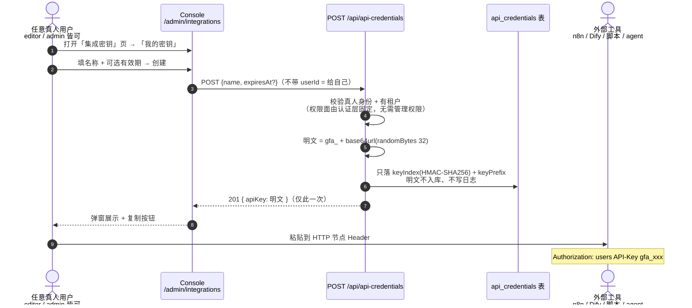
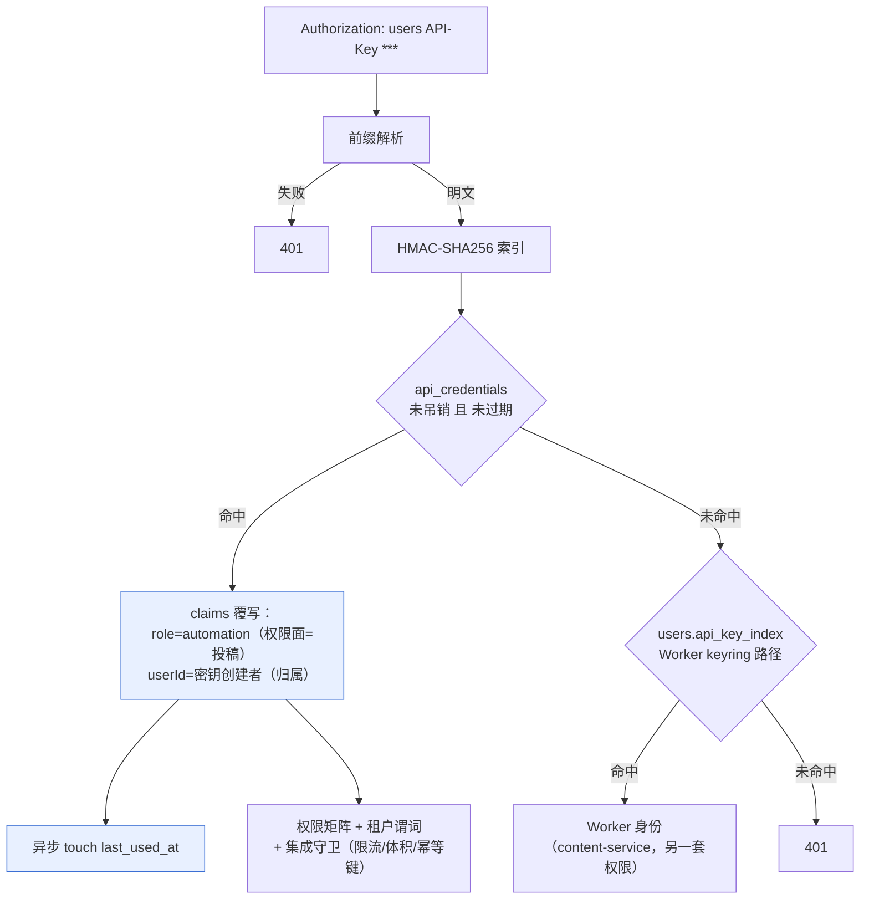
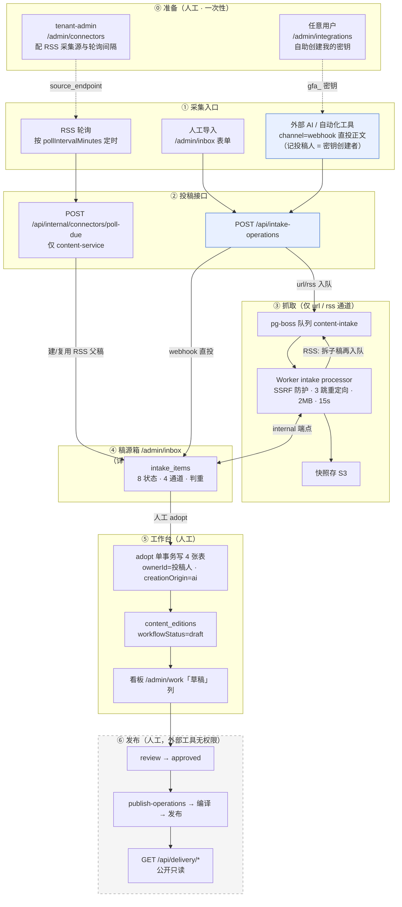
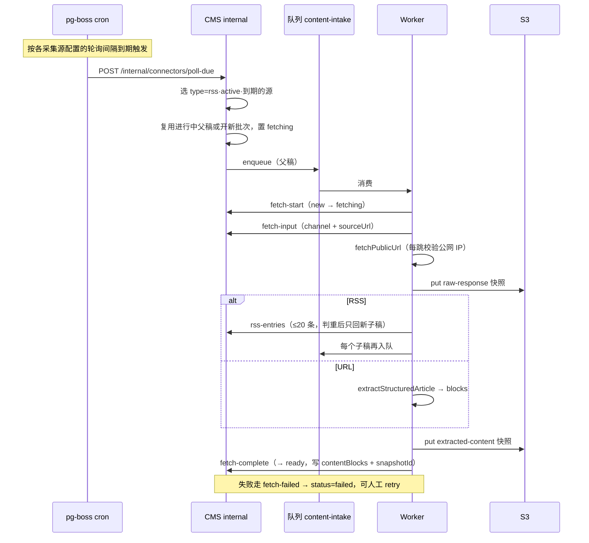
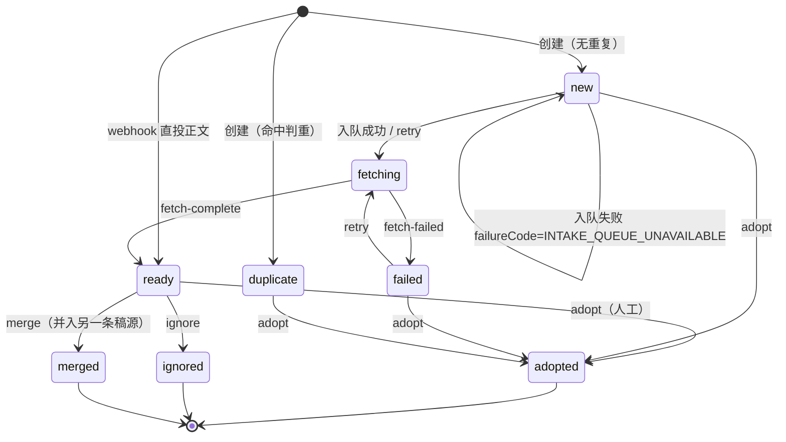

# 采集工具接入文档

面向把外部 AI / 自动化工具（n8n、Dify、脚本、AI agent）接入 Geo Foundry 采集链路的接入方：怎么拿密钥、怎么投稿、稿件去哪了、边界在哪。机器可读契约见 `GET /api/integration/openapi.json`（OpenAPI 3.1，公开只读），本文是其人读版。

## 1. 接入模型：只投稿，发布始终是人

- **密钥跟用户走**：任何真人在 Console「集成密钥」页（`/admin/integrations`）即可为自己创建密钥，无需管理员。用这把密钥采集的投稿记在你名下，采纳成文章后**作者归属是你**，并标注「AI 生成」来源。
- **权限面与角色无关**：不管绑定用户是 editor 还是 admin，`gfa_` 密钥的权限一律只有投稿（稿源箱 create/read、sites/connectors 只读）。密钥泄露的最坏影响是「向收件箱塞稿」。
- **外部工具明确没有权限**：采纳成草稿、创建/编辑文章、工作流流转、发布、传媒体、访问任何 `/api/internal/*` 端点——全部 403。发布链路（review → publish → delivery）只由人在 Console 驱动。

## 2. 快速开始

```bash
# ① Console「集成密钥」页创建自己的密钥，拿到 gfa_ 开头的明文（只显示一次）

# ② 先查一个目标站点 id（本租户、status=active）
curl -s "https://<本站域名>/api/sites?limit=100" \
  -H "Authorization: users API-Key gfa_xxxxxxxx"

# ③ 投稿（webhook 直投正文，入箱即「内容就绪」）
curl -X POST "https://<本站域名>/api/intake-operations" \
  -H "Authorization: users API-Key gfa_xxxxxxxx" \
  -H "Content-Type: application/json" \
  -H "Idempotency-Key: n8n-flow-17-item-3" \
  -d '{
    "channel": "webhook",
    "title": "自动驾驶保险的三个新问题",
    "summary": "简短摘要",
    "bodyMarkdown": "# 标题\n\n正文 markdown…",
    "suggestedSiteId": 374
  }'
# → 201 { intakeItem: { status: "ready", createdBy: <你的用户id>, … } }
```

之后在 Console「收件箱」（`/admin/inbox`）里看到这条稿源，人工点采纳即成文章草稿。

## 3. 流程图

### 3.0 密钥怎么来（自助创建）



管理员代签（兼容共享机器身份的用法）：tenant-admin 在同页「管理员代签」区块，可为租户内的「自动化投稿」身份或任意真人签发。

### 3.1 每次请求的认证路径



覆写是安全关键：密钥权限面与绑定用户角色解耦，用户升权/转岗不影响既有密钥；吊销（软删除，保留审计）在**下一次请求**即刻生效。

### 3.2 采集 → 工作台全景



灰色虚线框是外部工具明确没有权限的区域。

### 3.3 抓取时序（url / rss 通道）



### 3.4 稿源箱状态机



## 4. 密钥管理

| 操作 | 谁可以 | 入口 |
|---|---|---|
| 创建自己的密钥 | 任何真人用户（机器身份不行） | `/admin/integrations`「我的密钥」 |
| 代签（任意真人 / automation 身份） | tenant-admin、super-admin | 同页「管理员代签」 |
| 查看 | admin 见租户全部；普通用户只见自己的 | 同页列表（含归属、最后使用、状态） |
| 吊销 | 自己的密钥自己吊销；admin 吊销任意本租户的 | 列表「吊销」按钮 |

- 明文以 `gfa_` 开头，只在创建时展示一次，服务端只存 HMAC 索引；遗失只能吊销重建。
- 可设有效期，到期自动失效；吊销/过期在下一次请求即 401。
- 每次成功认证异步记 `last_used_at`，页面上可见密钥是否在被使用。

## 5. 三条投稿通道

| 通道 | 语义 | 必填 | 入箱状态 |
|---|---|---|---|
| `webhook` | **直投正文**（推荐自动化工具）：内容已在手，平台不抓取 | `bodyMarkdown`、`suggestedSiteId` | `ready`（内容就绪等人工采纳） |
| `url` | 投链接，平台排队抓取全文 | `sourceUrl` | `new` → `fetching` → `ready/failed` |
| `rss` | 平台按采集源定时轮询，通常无需外部工具触发 | `connectorId`（配采集源时用） | 同 url，父稿批量管理 |
| `manual` | Console 人工登记线索 | — | `new` |

webhook 直投的正文按文章正文的同一套块规则校验（坏内容入口即 400），并转 `contentBlocks` 存储；`suggestedSiteId` 必填是因为 Console 的采纳操作靠它解析目标站点——投前用 `GET /api/sites` 取本租户可选值。

## 6. API 参考

全部走统一认证头（delivery 两个公开端点除外）：`Authorization: users API-Key gfa_…`

### POST /api/intake-operations（投稿）

| 字段 | 类型 | 必填 | 说明 |
|---|---|---|---|
| `title` | string ≤1000 | 全部通道 | 标题，去重判定键之一 |
| `channel` | enum | 必填 | `webhook` / `url` / `rss` / `manual` |
| `bodyMarkdown` | string ≤200000 | webhook 推荐 | Markdown 正文，仅 webhook 允许 |
| `suggestedSiteId` | integer | webhook 必填 | 建议采纳站点 id |
| `sourceUrl` | string ≤4000 | url 必填 | 来源链接；utm/fbclid 等追踪参数自动去除后判重 |
| `connectorId` | integer | rss 必填 | 关联采集源 |
| `contentHash` | string ≤512 | 可选 | 内容寻址哈希，同哈希重投直接命中幂等 |
| `summary` | string ≤20000 | 可选 | 摘要 |

响应：`201` 新建（响应含 `intakeItem.createdBy` = 密钥创建者）；`200` 重复/幂等重放（`duplicateIds` 指向既有条目）；`202` 已建档但抓取队列暂不可用。

### GET /api/sites、GET /api/connectors（只读引用数据）

`?page=&limit=&sort=`，limit 上限 100。automation 密钥对二者只读——采集源的增删改在 Console「采集源」页人工操作。

### GET /api/integration/openapi.json

机器可读契约（OpenAPI 3.1），公开无需认证，可直接作为 AI agent 的工具描述生成可运行调用。

### GET /api/delivery/*（公开只读，无需认证）

- `GET /api/delivery/sites/{canonical-domain}/articles?page=&limit=&q=`：已发布文章列表（limit ≤50）。
- `GET /api/delivery/articles/{id}`：单篇完整正文块。
- 限流每 IP 60 次/分钟；自带 60s HTTP 缓存头，建议客户端缓存 5–15 分钟。

## 7. 幂等、守卫与错误码

- **幂等**（重试安全）：优先 `contentHash`，其次 webhook 正文哈希，再次 `Idempotency-Key`（`[A-Za-z0-9._-]{8,128}`）。重试返回首次结果（`idempotentReplay=true` 或 duplicateIds），不会塞满收件箱。网络超时直接重试是安全的。
- **守卫**（仅 API-Key 请求，Console 会话不受影响）：每身份 120 次/分钟（429 `INTEGRATION_RATE_LIMITED`）、请求体上限 1MiB（413 `INTEGRATION_BODY_TOO_LARGE`）。
- **常见错误码**：`INTAKE_SUGGESTED_SITE_REQUIRED`（webhook 缺站点）、`INTAKE_BODY_MARKDOWN_EMPTY`（正文空白）、`INTAKE_BODY_MARKDOWN_CHANNEL_INVALID`（非 webhook 带正文）、`INTAKE_URL_INVALID`（链接非 http/https）、`INTAKE_EDITOR_REQUIRED`（越权操作，如用密钥 adopt）。
- 自带 `X-Request-Id` 会原样回显在响应头，便于对账。

## 8. 归属与来源标注

| 环节 | 落点 |
|---|---|
| 投稿 | `intake_items.created_by_id` = 密钥创建者；收件箱详情显示「Submitted by」 |
| 采纳 | 文章 `owner_id` = 密钥创建者；`creation_origin` = `ai`（文章详情显示「AI 生成」） |
| 溯源 | `article_sources.intake_item_id` 指回稿源条目；`citations` 带 sourceUrl |

人工在 Console 登记（manual）的线索不记归属，采纳后保持无 owner + 人工创作，与自动化通道语义区分。

## 9. n8n / Dify / AI agent 接法

- **n8n**：HTTP Request 节点 → Method POST、URL `https://<本站域名>/api/intake-operations`；Authentication 用 Generic Credential Type → http Header Auth（Name `Authorization`，Value `users API-Key gfa_…`）；Body JSON 映射上游字段；建议 Headers 带 `Idempotency-Key`（表达式拼流程 id + 条目 id）。
- **Dify**：工作流 HTTP 节点，同 URL 与认证头，Body 用 JSON 模式，把 `title/bodyMarkdown/suggestedSiteId` 绑定到上游变量。
- **AI agent**：把 `/api/integration/openapi.json` 内容作为工具描述喂给 agent，即可自动生成可运行的投稿调用。

## 10. 相关 Console 页面

| 页面 | 路径 | 用途 |
|---|---|---|
| 集成密钥 | `/admin/integrations` | 创建/吊销密钥（本文 §4） |
| 接入文档 | `/admin/integration-docs` | 本文的 Console 内版本 |
| 收件箱 | `/admin/inbox` | 看投稿、采纳/忽略/合并 |
| 采集源 | `/admin/connectors` | RSS 源与轮询间隔（tenant-admin） |
| 工作台 | `/admin/work` | 采纳后的草稿进看板「草稿」列 |
